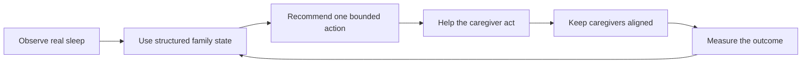

# Somni vs ChatGPT: The Honest Competitive Benchmark

**Last reviewed:** 19 July 2026

**Conclusion:** Somni is not proven better than ChatGPT overall. Its defensible advantage is
narrower: Somni is designed as a closed-loop, structured infant-sleep workflow, while ChatGPT is
a much broader conversational and research product. Somni can be more useful for a tired family
when it reliably turns shared sleep data into one safe next action, records what happened, and
uses the outcome to guide the next decision.

This is a product-positioning conclusion, not a head-to-head model result. As of this review, **no
current blinded, equivalent-context response benchmark has been run between Somni and ChatGPT**.
The existing Somni retrieval and safety evaluations do not answer that comparative question.

## Current ChatGPT benchmark

The comparison must reflect current ChatGPT rather than an empty, unconfigured chat. Depending on
plan, account, region, settings, and rollout, ChatGPT can retain relevant context through memory,
organise continuing work in Projects, search the web with linked citations, conduct multi-step
research, analyse uploaded files, support spoken interaction, and run scheduled tasks.

Official OpenAI references:

- [Memory FAQ](https://help.openai.com/en/articles/8590148-memory-faq)
- [Projects in ChatGPT](https://help.openai.com/en/articles/10169521-projects-in-chatgpt)
- [ChatGPT Search](https://help.openai.com/en/articles/9237897-conducting-your-searches-on-search)
- [Deep research in ChatGPT](https://help.openai.com/en/articles/10500283-deep-research)
- [Voice Mode FAQ](https://help.openai.com/en/articles/8400625-voice-mode-faq)
- [File Uploads FAQ](https://help.openai.com/en/articles/8555545-file-uploads-faq)
- [Scheduled tasks in ChatGPT](https://help.openai.com/en/articles/10291617-scheduled-tasks-in-chatgpt)

A parent who creates a well-maintained Project, supplies the same baby details and sleep history,
uploads relevant records, and asks a precise question may receive excellent guidance. Somni must
therefore win through lower parent effort, safer product constraints, and reliable follow-through,
not through friendlier prose or a claim that generic ChatGPT lacks context.

## The narrow advantage Somni is built to earn

ChatGPT can advise and, with deliberate setup, retain rich context. Somni's opportunity is to make
the entire loop the default product behaviour: know which baby is active, whether a sleep session
is already running, what plan the family accepted, what changed, who acted, and what happened next.
That structured loop is more defensible than the quality of any single chat response.

## Fair comparison

| Area | Current ChatGPT | Somni today | Honest assessment |
| --- | --- | --- | --- |
| General reasoning and writing | Broad general-purpose capability across many domains | Focused infant-sleep coach | ChatGPT is stronger overall; Somni should not compete on prose alone |
| Persistent context | Memory, chat history, Projects, files, and connected data where available | Structured baby profiles, sleep events, plans, messages, and AI memory | Different strengths; Somni's state is more task-specific, but only valuable when data integrity is dependable |
| Current research and citations | Search and Deep Research can return linked web sources | Curated Australian infant-sleep retrieval | ChatGPT is stronger for broad/current research; Somni can be narrower and more consistent |
| Source transparency | Search responses can expose clickable citations | Somni names sources, but current answer citations are not clickable or directly inspectable | ChatGPT is currently stronger on source inspection |
| Files and multimodality | File analysis and broad multimodal features are available, subject to product limits | Purpose-built sleep-entry and dashboard flows | ChatGPT is broader; Somni can reduce the effort required for recurring sleep data |
| Voice and low-friction use | Mature spoken conversation through Voice Mode | Limited purpose-built quick actions; no equivalent hands-free coaching flow | ChatGPT is stronger today |
| Reminders and proactive follow-up | Scheduled tasks can run later, subject to availability and task limits | Plans, caregiver feed, and sleep-session notifications | Neither is an automatic win; Somni's follow-up can be more sleep-specific if it is reliable |
| Shared family state | Projects can share chats, files, and instructions | Caregivers can operate on the same baby record, logs, and accepted plan | Somni has a narrower workflow advantage once roles, invites, and concurrency are proven |
| Live sleep state and action | Relevant state generally has to be supplied, uploaded, or connected | One active sleep session and bounded sleep actions are first-class records | This is Somni's clearest current product differentiation |
| Safety boundaries | Strong platform safeguards applied to a general-purpose product | Deterministic infant-sleep boundaries plus curated prompting and retrieval | Somni's design is promising, but superiority requires adversarial and regression evidence |
| Outcome learning | A user can report results conversationally | Product state can associate plans, sleep events, and later outcomes | Somni has the better workflow shape; dependable causal claims are not yet proven |

## What Somni can defensibly claim today

- It captures recurring sleep information as structured product state rather than requiring the
  family to reconstruct every detail in a prompt.
- It supports a purpose-built active sleep session, daily and durable plan state, and bounded plan
  changes in the same workflow.
- Approved caregivers can work from the same baby record and see the same operational state.
- Its retrieval and safety design is deliberately scoped to Australian infant-sleep guidance.
- It can decline to present a confident sleep score when the available data is too sparse.

These are capability claims, not proof that Somni gives a better answer than ChatGPT.

## Where ChatGPT is stronger or at least equal

- General reasoning, writing, breadth of knowledge, multimodal interaction, and mature voice use.
- Open-ended web research, current information gathering, file analysis, and linked source
  inspection.
- Flexible user-created Projects that can hold detailed family context and instructions.
- Ad hoc analysis for an expert user who is willing to prepare context and craft a precise prompt.
- Scheduled or proactive tasks where the available ChatGPT feature fits the parent's need.

Somni should assume that ChatGPT's underlying models and product features will keep improving.
Its moat must live in trusted workflow execution and accumulated structured outcomes, not in a
temporary model-quality gap.

## Trust gaps Somni must close

- Somni's named answer sources are currently plain text rather than clickable evidence. A parent
  cannot easily inspect the exact source behind a claim.
- The Stage 7 review must close or explicitly gate any remaining data-integrity, active-baby,
  duplicate-write, permission, and caregiver-concurrency risks. Incorrect structured state is more
  dangerous than missing context because it can make a personalised answer confidently wrong.
- Safety superiority is not established until the complete adversarial suite and real response
  evaluation pass with traceable evidence.
- Product analytics do not yet prove that families act on recommendations or that the action
  improves the next relevant sleep outcome.
- A blinded, equivalent-context benchmark is still required before marketing Somni as producing
  better guidance than ChatGPT.

## Required benchmark method

1. Create a fixed, de-identified test pack containing the same baby profile, recent sleep events,
   current plan, constraints, question, and evaluation timestamp for both products.
2. Give ChatGPT a fair configuration: an appropriate Project, the supplied files/context, and
   Search where the scenario calls for current information. Record plan and feature availability.
3. Record setup effort separately: time, number of fields or uploads, prompt length, and ongoing
   maintenance required.
4. Blind-score both answers for correctness, safety, specificity, use of supplied state,
   uncertainty, source traceability, and immediate usefulness.
5. Test the workflow after the answer: action capture, duplicate prevention, caregiver visibility,
   conflict handling, reminder or follow-up, and outcome measurement.
6. Pre-register the rubric and thresholds. Report ties and ChatGPT wins; do not change criteria
   after seeing the outputs.

## Four prioritised product options

### 1. Outcome-aware bounded experiments — recommended after integrity gates

Let a family opt into one small, reversible plan change at a time, record the hypothesis and
baseline, measure a pre-defined outcome, and then keep, revert, or stop the change. Add conservative
limits, explicit consent, safety exclusions, uncertainty language, and a human-readable audit trail.
This most directly compounds Somni's closed-loop advantage.

**Prerequisite:** do not begin this work until sleep-event integrity, active-baby isolation,
caregiver permissions, idempotent writes, and launch-blocking safety findings are demonstrably
closed. Outcome automation built on unreliable data would amplify error.

### 2. Clickable evidence cards and provenance

Turn each important sleep claim into an inspectable card with the source title, organisation,
publication or review date, exact relevant passage or faithful summary, and a working link. Clearly
separate retrieved evidence from Somni's personalised inference. This closes the clearest trust gap
against ChatGPT Search.

### 3. Clinician-ready weekly sleep report

Generate a concise, exportable timeline showing sleep totals, variability, plan changes, outcomes,
data gaps, and safety notes without presenting a diagnosis. A parent could share it with a GP,
child-and-family health nurse, or sleep professional. This makes Somni's structured data useful
beyond chat while keeping clinical interpretation with a qualified person.

### 4. Hands-free night mode

Add a low-light, one-handed or voice-first flow for starting and ending sleep, asking the next
question, hearing a short answer, and confirming any state-changing action. Require explicit
confirmation and make corrections easy. This targets the moment when generic chat setup is most
burdensome, while recognising that ChatGPT currently has the stronger general voice experience.

## Product recommendation

Choose **Option 1, outcome-aware bounded experiments**, as the strategic differentiator—but only
after the Stage 7 data-integrity and safety gates are green. In parallel, Option 2 is the best
lower-risk trust improvement. Option 3 creates a strong professional handoff, while Option 4 is a
high-value convenience bet with greater interaction and safety complexity.

The winning standard is not “Somni wrote a nicer answer.” Somni wins when a tired parent can receive
a safe, specific, explainable next action based on correct shared state, act with very little effort,
and see the family record and subsequent decision update reliably from the real outcome.

The implementation and evidence requirements are tracked in
[`Somni_Implementation_Plan_Alpha_1.2.md`](Somni_Implementation_Plan_Alpha_1.2.md), especially
Stages 2, 4, and 7.
