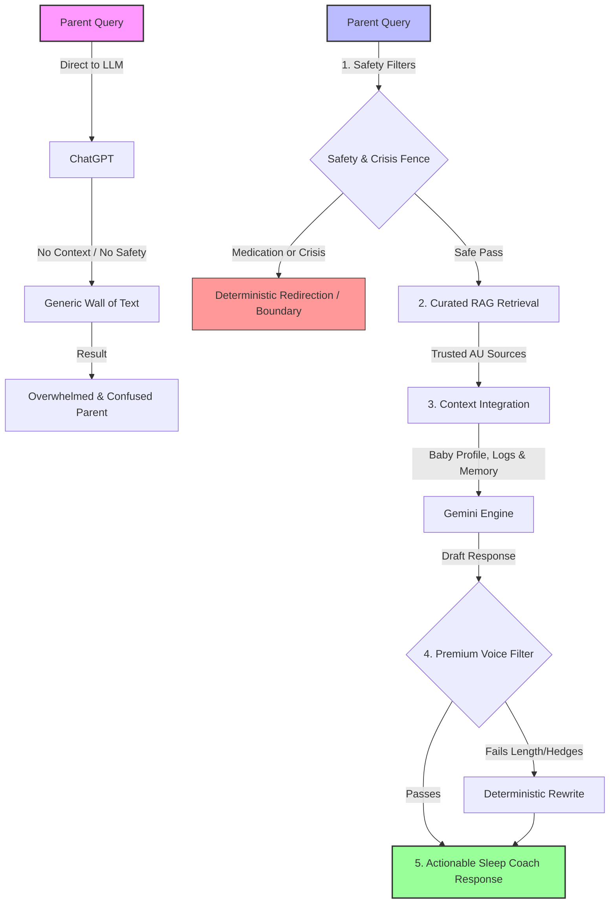

# Somni vs. ChatGPT: Why a Specialized Sleep Coach Wins

For tired parents, search engine fatigue and conflicting online advice are overwhelming. While generic AI models like **ChatGPT** can generate human-like text, they lack the specific guardrails, local context, and integrations required for safe, effective, and stress-free pediatric sleep coaching.

Here is how **Somni** compares to and outperforms generic LLMs:

---

## The Parent's Journey: Side-by-Side Flow

The diagram below shows how a parent's query is processed in both systems. Notice how Somni wraps the LLM with database context, safety fences, and tone validation to ensure a safe, concise, and helpful response.

---

## Comparison Matrix: Somni vs. ChatGPT

| Feature Area | Generic ChatGPT (GPT-4o / GPT-3.5) | Somni (Specialized Infant Sleep Coach) |
| :--- | :--- | :--- |
| **Primary Focus** | General-purpose assistant across all topics. | **Sleep-first coaching** for babies and young children. |
| **Knowledge Base** | General web scrape; includes outdated, conflicting, or unsafe advice. | **Curated pediatric corpus** (Red Nose, Tresillian, Karitane, Raising Children Network). |
| **Pediatric Safety** | No hard boundaries; might suggest unsafe sleep items or diagnose issues. | **Deterministic safety fences** for medication, safe sleep hazards, and medical crises. |
| **Baby Context** | None. Forgets details once the session ends unless manually re-typed. | **Persistent baby profile**, sleep logs, sleep score, and daily plan integration. |
| **Empathetic Pacing** | Often uses repetitive, superficial empathy boilerplate. | **Empathetic but concise** voice (under 160 words, single actionable starting point). |
| **Real-time Sync** | Single-user only. | **Caregiver sharing** allowing co-parents and nannies to log and sync in real-time. |

---

## Key Superiority Pillars

### 🛡️ 1. Deterministic Pediatric Safety Fences
Generic LLMs are prone to "hallucinations" and will often confidently answer medical queries. Somni implements strict, deterministic code boundaries before the query ever reaches the AI:
*   **Medication Boundary:** If a parent asks about dosing or medication safety (e.g., Panadol, Nurofen, melatonin), Somni halts the AI and outputs a strict refusal to prescribe, directing the parent to a GP or pharmacist.
*   **Safe Sleep Filter:** Any recommendation involving hazardous items in the crib (loose blankets, bumpers, pillows, toys, heat packs) is caught and flagged to maintain Australian SIDS safety alignment.
*   **Urgent Medical Escalation:** Clinical red flags (lethargy, high fever, difficulty breathing) bypass sleep coaching entirely, showing a prominent redirect to **000** or emergency services.

### 📚 2. Australia-First Curated Knowledge (RAG)
Instead of sourcing answers from unregulated blogs, Somni retrieves context from a vetted vector database of trusted Australian health resources:
*   Red Nose Australia (SIDS prevention authority)
*   Tresillian and Karitane (Early parenting services)
*   Raising Children Network & Royal Children's Hospital (RCH) Melbourne
*   *Result:* Australian English terminology, metric units, and evidence-based methods.

### 🧠 3. Persistent Memory & Context Integration
To get a good recommendation from ChatGPT, you would need to paste your baby's age, sleep schedule, feeding habits, daycare rules, and your parenting philosophy into every prompt. Somni automates this:
*   **Durable Learned Profile:** Stores baseline settings like normal wake times, target bedtime, and parenting style (Gentle, Balanced, Fast Track).
*   **Sleep Score & Logging:** Tracks actual sleep logs over a 7-day window. The AI knows exactly when your baby slept today and adjusts advice based on real data.
*   **Durable Memory:** A background cron job runs nightly to summarize the day's conversations and update the baby's `ai_memory` column, maintaining context over months.

### 🎙️ 4. Premium Voice & Cognitive Pacing
Tired parents do not want to read a 500-word essay with 10 bulleted options.
*   **Length & Hedge Restrictions:** Response filters eliminate robotic boilerplate ("sounds like...", "Oh, I hear you...") and enforce an average length under 160 words.
*   **Single Starting Point:** Somni is trained to recommend **exactly one** clear, low-friction next step to prevent decision fatigue.
*   **Query-Aware Structure:** Simple factual questions get direct, short answers, while complex situations receive a structured compromise plan.

### 👥 5. Co-Parenting and Caregiver Handoffs
Unlike a private ChatGPT account, Somni is built for families:
*   **Baby Join Table (`baby_shares`):** Easily invite co-parents, grandparents, or nannies to a baby's profile via email.
*   **Real-time Synchronization:** All caregivers see the same sleep logs, daily plans, and chat context. Updates made by Mum at work are instantly visible to Dad at home.
