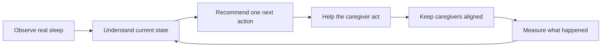

# Somni vs ChatGPT: The Honest Competitive Benchmark

**Last reviewed:** 17 July 2026

**Purpose:** Define the product advantage Somni must prove, without understating current ChatGPT.

Somni should not claim that ChatGPT has no memory, cannot use files, cannot search trusted
sources, or is always single-user. Current ChatGPT can use memories and chat history, Projects
can hold files and instructions with project memory and sharing, Search can return linked
sources, and ChatGPT Health introduces health-specific context and memory in supported access.

Official capability references:

- [OpenAI Memory FAQ](https://help.openai.com/en/articles/8590148-memory-faq)
- [Projects in ChatGPT](https://help.openai.com/en/articles/10169521-projects-in-chatgpt)
- [ChatGPT Search](https://help.openai.com/en/articles/9237897-conducting-your-searches-on-search)
- [What is ChatGPT Health?](https://help.openai.com/en/articles/20001036-what-is-chatgpt-health)

Those features make ChatGPT a serious benchmark. A parent who deliberately creates a project,
uploads a routine, maintains context, and asks a detailed question can receive strong sleep
guidance. Somni must therefore win through less parent effort, safer product constraints, and a
closed workflow tied to live family state—not merely through friendlier prose.

## The advantage Somni must build

This loop is Somni's intended moat. ChatGPT can advise; Somni should know the current sleep
session, today's accepted plan, pending changes, real constraints, caregiver activity, and the
outcome of the previous action without asking an exhausted parent to reconstruct everything in
a prompt.

## Fair comparison

| Area | Current ChatGPT benchmark | Somni today | Alpha 1.2 target |
| --- | --- | --- | --- |
| General reasoning and writing | Broad, strong general-purpose capability | Focused Gemini-based coach with concise voice controls | Do not compete on prose alone |
| Persistent context | Memory, chat history, files, connected apps, and project context depending on plan/settings | Structured baby profile, logs, plans, messages, and AI memory | Make structured state visibly improve each action |
| Source-backed answers | Web Search can provide current links and citations | Curated Australian sleep corpus with retrieval | Keep trusted sleep sources inspectable and safety-aligned |
| Health context | Health-specific memory/context is available as access rolls out; some connected health data is region/device limited | Sleep-specific fields and Australian product rules | Be precise about scope; never imply clinical care |
| Collaboration | Shared Projects can combine chats, files, and instructions | Shared baby records, sleep logs, plans, feed, and push alerts | Enforce roles and make caregiver handoffs dependable |
| Live sleep state | Parent generally has to supply or connect the relevant data and maintain it | Direct sleep logging and active-session state | Turn current state into a concrete Next Best Action |
| Acting on advice | Primarily conversational unless a tool/integration is configured | Can start/end logs and update bounded daily/durable plan state | Revalidate actions, prevent duplicates, and measure outcomes |
| Safety | Platform safeguards plus model behaviour; configuration is general-purpose | Deterministic Somni boundaries plus curated prompting/retrieval | Prove boundaries through regression and adversarial tests |
| Parent effort | Can be excellent with a well-maintained project and detailed prompts | Product captures recurring sleep data and preferences | Require less re-explanation and less prompt skill |

## Where Somni is genuinely differentiated today

- Sleep logs, a single active sleep session, daily plans, durable plan profiles, and plan-change
  events are structured product state rather than prose in a conversation.
- Same-day schedule rescue can calculate a damped change and ask a parent to accept it without
  silently rewriting the durable baseline.
- Caregivers can share the same baby record and receive in-app or Web Push sleep-session alerts.
- Australian sources, language, emergency direction, and specific sleep-safety boundaries are
  built into the product design.
- The sleep score can admit when data is too sparse rather than inventing certainty.

## Where Somni does not yet win reliably

- In the July 2026 live review, a short-nap question received a generic wake-window adjustment
  rather than referencing the actual logged duration, current plan, current time, and a concrete
  next target.
- Chat may spend roughly 4,000 prompt tokens and two generation calls on an ordinary response,
  making a generic chat experience competitive on speed and cost.
- Invitation, role, navigation, support, concurrency, and mobile-recovery defects weaken the
  operational advantage of a dedicated product.
- The app does not yet consistently show one obvious Next Best Action as soon as the parent
  opens it.

These are product gaps, not copy problems. They are addressed by Alpha 1.2 Stages 0–5.

## Benchmark method

Use a current, well-configured ChatGPT comparison rather than an empty chat with no context.

1. Give both systems the same baby details, recent logs, plan, constraints, and parent question.
2. Let the ChatGPT comparison use an appropriate Project, memory, and Search where available.
3. Do not count setup effort as zero; record what the parent had to enter, upload, or maintain.
4. Blind-score correctness, safety, specificity, uncertainty, effort, and immediate usefulness.
5. Then test what happens after the advice: logging, plan updates, caregiver visibility, conflict
   handling, reminders, and outcome measurement.
6. Record where ChatGPT is equal or better. Do not rewrite the criteria after seeing results.

## Success standard

Somni wins when a tired parent can open the app and receive a safe, specific, explainable action
based on current shared data, act on it with one low-friction step, and have the product update the
family's state and learn from the outcome. If Somni only produces a similar answer in a dedicated
chat screen, generic ChatGPT remains the stronger value benchmark.

The implementation and evidence requirements for this advantage are in
`docs/Somni_Implementation_Plan_Alpha_1.2.md`, especially Stages 2, 4, and 7.
